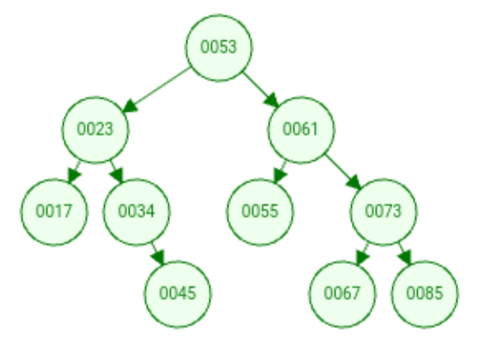
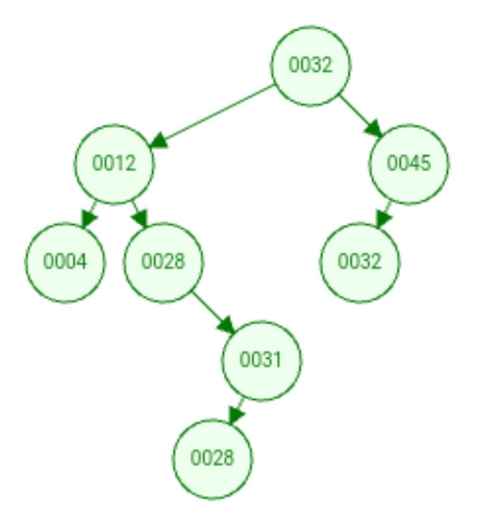

# U1T3 - Desafio de Implementação

Atividade realizada por:
- **Aluno**: [Carlos Gabriel Medeiros da Silva](https://github.com/CarlosG18) **matricula**: 20230093859
- **Aluno**: [Jean Magnus Araujo de Souza Junior](https://github.com/JeanMagnus) **matricula**: 20240001171

## [1/5] 🤔 Definindo os problemas

Os problemas resolvidos são fornecidos pelo [repositorio do professor Ivanovitch](https://github.com/ivanovitchm/datastructure) referentes ao assunto da **semana 4**.


### 📌 Problema 1

- **definição:** Dado um valor ( k ) e uma árvore de busca binária (BST) não vazia com valores distintos, encontre o valor mais próximo de ( k ) na BST.

- **exemplo:**

<p align="center">
    
</p>

- **input**: k = 43 -> **output**: 45

- **aplicação desse problema:** Esse problema pode ser útil em sistemas de busca, como em um sistema de busca de produtos online. Por exemplo, um usuário pode inserir um preço desejado e o sistema pode usar a árvore de busca binária para encontrar produtos com preços mais próximos ao valor especificado pelo usuário, mesmo que não haja um produto com o preço exato. Isso pode melhorar a experiência do usuário ao permitir que ele encontre produtos que atendam às suas necessidades, mesmo que não tenham preços exatos correspondentes.

***

### 📌 Problema 2

- **definição:** Dada uma árvore de busca binária (BST) não vazia, retorne o ( k )º maior elemento da BST, onde ( k ) é uma variável inteira fornecida.

- **exemplo:**
<p align="center">
    
</p>

- **input**: k = 6 -> **output**: 28

- **aplicação desse problema:** Esse problema pode ser útil em situações onde é necessário encontrar valores específicos em uma coleção ordenada, como em sistemas de análise de dados para encontrar percentis específicos em conjuntos de dados. Por exemplo, em um sistema de análise de vendas, pode-se usar esse algoritmo para encontrar o produto que está no ( k )º lugar em termos de vendas, ajudando a identificar os produtos mais populares.

## [2/5] 💡 Soluções

### 📌 Problema 1

Para a resolução desse problema, foi criado uma função chamada `findClosestValue()`, que recebe uma árvore BST e um valor que deseja ser encontrado, ou um valor próximo a ele, nessa árvore. Então para o desenvolvimento da função, primeiramente foi criada uma variável que armazenará o valor atual mais próximo do valor desejado, inicialmente nulo. Então, foi criada uma função para atravessar a árvore, recursivamente, a fim de encontrar este valor desejado. Dessa forma, a função analisa nó por nó, se houver um valor mais próximo que o valor almejado ele será armazenado na variável 'closest_value' declarada acima. Tudo isso é analisado com base na propriedade da BST.

Segue abaixo a função criada:

```python
def findClosestValue(tree, target):
    # Iniciando a variável como nula
    closest_value = None

    # Função auxiliar para percorrer recursivamente
    def traverse(node):
        nonlocal closest_value

        # Caso base: se o nó atual analisado for nulo, retorne a função imediatamente
        if node is None:
            return

        # Atualiza o valor mais próximo (na variável) caso seja necessário
        if closest_value is None or abs(node.value - target) < abs(closest_value - target):
            closest_value = node.value

        # Continua a busca atravessando a árvore com base nas propriedades da BST
        if target < node.value:
            traverse(node.left_child)
        elif target > node.value:
            traverse(node.right_child)

    # Inicia a busca/travessia a partir do nó raiz da árvore
    traverse(tree.root)

    return closest_value
```

- [](https://github.com/CarlosG18/aedii_dca0209/blob/main/unidade1/U1T3/challenge_01_closestvalue.ipynb) - notebook com o primeiro desafio.
-  [](https://github.com/CarlosG18/aedii_dca0209/blob/main/unidade1/U1T3/solution_01.ipynb) - notebook com a solução e testes.

---

### 📌 Problema 2

- [](https://github.com/CarlosG18/aedii_dca0209/blob/main/unidade1/U1T3/challenge_02_kth_largest.ipynb) - notebook com o segundo desafio.

A função `findKthLargestValue()` definida a seguir é a função responsável por resolver o problema 2: 

```python
def findKthLargestValue(tree, k):
    """
    Finds the kth largest integer in a Binary Search Tree (BST).

    The function traverses the BST in an in-order manner to collect the node values in a sorted list.
    It then returns the kth largest value from this list. The BST is assumed to contain only integer values.
    In case of duplicate integers, they are treated as distinct values.
    The kth largest integer is determined in the context of these distinct values.

    Parameters:
    tree (BST): the Binary Search Tree (BST).
    k (int): A positive integer representing the kth position.

    Returns:
    int: The kth largest integer present in the BST.
    """
    vector = []
    index_aux = [k]

    search_element(vector, tree.root, index_aux)

    return vector[0]
```

**vamos entender melhor como a solução foi elaborada:**

Basicamente seguimos a seguinte lógica:

- inicialmente declaramos duas listas que possuiram tamanho 1. O `vector` será a lista que possuirá o valor correspondente ao kesimo maior elemento da BST, já a lista `index_aux` será a lista que conterá o numero de nós que deveremos passar até chegar no nó correto:

```python
vector = []
index_aux = [k]
```

Em seguida chamamos a função `search_element()` passando como argumentos o `vector`, o nó raiz da bst (tree.root) e o `index_aux`.

```python
search_element(vector, tree.root, index_aux)
```

Vamos entender melhor como funciona essa função `search_element()`:

```python
def search_element(vector, node, index_aux):
    """
        função que obtem um vetor com o nó desejado

        argumentos:
            - vector: vetor que armazenará o valor correto
            - node: nó raiz da arvore
            - index_aux: vetor de auxilio para encontrar o valor correto

        retorno:
            - None
    """
    if index_aux[0] < 0:
        return
                   
    if node.right_child is not None:
        search_element(vector, node.right_child,index_aux)
    
    index_aux[0] = index_aux[0] - 1
    if index_aux[0] == 0:
        vector.append(node.value)
        return
    
    if node.left_child is not None:
        search_element(vector, node.left_child, index_aux)
```

Basicamente nessa função recursiva, os primeiros elementos visitados são os elementos da direita, que pela definição da **BST**, possui os maiores valores à direita. a cada visita, a variável `index_aux[0]` é decrementada, e após isso, é feita a verificação, onde se o valor de `index_aux[0]` for igual a zero, o valor do nó atual deverá ser adicionado no vetor `vector`. isso garante que o vetor seja preenchido apenas com um valor e com o valor correto. caso o `index_aux[0]` for menor que zero, é retornado, já que não será mais preciso verificar os próximos nós.

- Por fim obtemos o valor resposta aplicando a seguinte expressão na função `findKthLargestValue()`:

```python
return vector[0]
```

## [3/5] 🧪 Como executar os codigos e testes

Tanto o notebook referente ao problema 1 quanto o problema 2 possuem testes para garantir que as funções desenvolvidas funcionem adequadamente. 

**para rodar os testes diretamente do notebook:**

```bash
!pytest closestvalue.py -vv
```

**caso você queira rodar em seu ambiente de desenvolvimento**:

- crie o arquivo que conterá os testes (lembrando que as funções de teste devem começar com a palavra `test`);

- execute o comando:

```bash
$ pytest <nomedoarquivo>.py
```

## [4/5] ⌛ Análise da complexidade dos problemas

### 📌 Problema 1:
Após analisar o funcionamento da função encontrada para a solução do problema, percebemos que a complexidade da função `findClosestValue()` depende do tamanho da árvore de busca binária e da profundidade do nó mais próximo ao valor alvo.

Em média, a complexidade de tempo é O(log(N)), onde N é o número de nós na árvore. Isso ocorre porque, em média, a busca em uma árvore de busca binária é logarítmica em relação ao número de elementos na árvore. No entanto, no pior caso, a complexidade de tempo pode ser O(N), onde N é o número de nós na árvore. Isso ocorre quando a árvore está desbalanceada e a busca percorre todos os nós da árvore.

A complexidade de espaço é O(1), pois não são utilizadas estruturas de dados adicionais que dependem do tamanho da entrada.

- 🤔 Dito isso, chegamos a um questionamento: quais são as vantagens e desvantagens de resolver esse problema de forma iterativa em vez de recursivamente? 

Podemos responder esse questionamento analisando o funcionamento, e resumidamente, a abordagem iterativa oferece eficiência de espaço, controle direto sobre o fluxo de execução e evita o risco de estouro de pilha, mas pode ser mais complexa em alguns casos e menos expressiva em comparação com a recursiva. 

---

### 📌 Problema 2:

Dado que o problema 2 foi devidamente solucionado, uma questão vem a cabeça... será que essa solução é boa em termos de tempo de execução e memória 🤔? vamos fazer um estudo melhor sobre essa solução.

**Complexidade de Tempo**:

Aplicando os conhecimetos adquiridos nos notebooks anteriores sobre [📌 U1T2 - Tempo de complexidade dos Algoritimos](https://github.com/CarlosG18/aedii_dca0209/blob/main/unidade1/U1T2/u1t2.md) podemos definir a complexidade da função `findKthLargestValue()` desta forma:

```python
def findKthLargestValue(tree, k):
    vector = []                                      # 1
    index_aux = [k]                                  # 1

    search_element(vector, tree.root, index_aux)     # O(?)

    return vector[0]                                 # 1
```

Observamos que a complexidade da função `findKthLargestValue()` depende diretamente da complexidade da sua função auxiliar `search_element()`. A complexidade de tempo da `search_element()` e influenciada pelo valor do parâmetro `k`:

- **Melhor caso**: O melhor caso será quando o valor do parâmetro `k == 1`. Nessa situação a função dependerá apenas da altura da **BST** (h).

- **Pior caso**: Já no pior caso, seria quando o valor de `k == n`, sendo n o valor dos total de elementos da **BST**, ou seja, podemos afirmar que a complexidade depende do valor da variável `k`.

sendo assim, podemos afirmar que a complexidade da função `search_element()` pode ser definida como `O(h + k)`e consequentemente podemos concluir também que a complexidade da função `findKthLargestValue()` se resume a `O(h + k)`.

Já em relação de complexidade de memória, precisamos de um vetor de tamanho 1, se fissermos vista grossa para isso, podemos concluir que o algoritmo `findKthLargestValue()` é de `O(1)`

## [5/5] 🎥 Video Explicativo

- 🎥 [Link do video](https://youtu.be/xwxDhFiRqoA)
