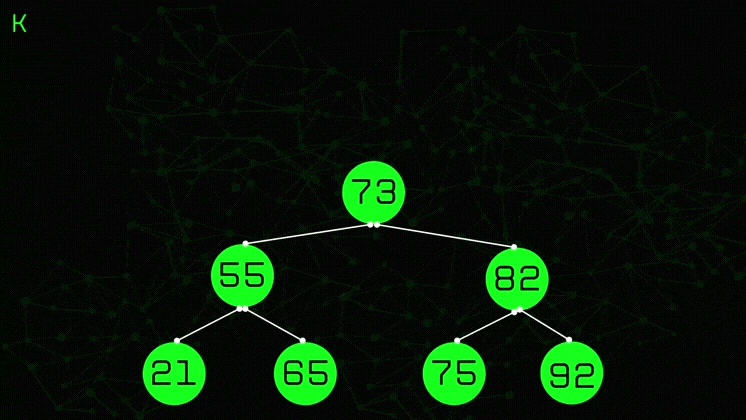

# U1T3 - Desafio de Implementação

Atividade realizada por:
- **Aluno**: [Carlos Gabriel Medeiros da Silva](https://github.com/CarlosG18) **matricula**: 20230093859
- **Aluno**: [Jean Magnus Araujo de Souza Junior](https://github.com/JeanMagnus) **matricula**: 20240001171

## [1/5] 🤔 Definindo os problemas

Os problemas resolvidos são fornecidos pelo [repositorio do professor Ivanovitch](https://github.com/ivanovitchm/datastructure) referentes ao assunto da **semana 4**.


### 📌 Problema 1

- **definição:** Dado um valor ( k ) e uma árvore de busca binária (BST) não vazia com valores distintos, encontre o valor mais próximo de ( k ) na BST.

- **exemplo:**

<center>
    
</center>

- **input**: k = 43 -> **output**: 45

- **aplicação desse problema:** Esse problema pode ser útil em sistemas de busca, como em um sistema de busca de produtos online. Por exemplo, um usuário pode inserir um preço desejado e o sistema pode usar a árvore de busca binária para encontrar produtos com preços mais próximos ao valor especificado pelo usuário, mesmo que não haja um produto com o preço exato. Isso pode melhorar a experiência do usuário ao permitir que ele encontre produtos que atendam às suas necessidades, mesmo que não tenham preços exatos correspondentes.

***

### 📌 Problema 2

- **definição:** Dada uma árvore de busca binária (BST) não vazia, retorne o ( k )º maior elemento da BST, onde ( k ) é uma variável inteira fornecida.

- **exemplo:**
<center>
    
</center>

- **input**: k = 6 -> **output**: 28

- **aplicação desse problema:** Esse problema pode ser útil em situações onde é necessário encontrar valores específicos em uma coleção ordenada, como em sistemas de análise de dados para encontrar percentis específicos em conjuntos de dados. Por exemplo, em um sistema de análise de vendas, pode-se usar esse algoritmo para encontrar o produto que está no ( k )º lugar em termos de vendas, ajudando a identificar os produtos mais populares.

## [2/5] 💡 Soluções

### 📌 Problema 1

Para a resolução desse problema, foi criado uma função chamada `findClosestValue()`, que recebe uma árvore BST e um valor que deseja ser encontrado, ou um valor próximo a ele, nessa árvore. Então para o desenvolvimento da função, primeiramente foi criada uma variável que armazenará o valor atual mais próximo do valor desejado, inicialmente nulo. Então, foi criada uma função para atravessar a árvore, recursivamente, a fim de encontrar este valor desejado. Dessa forma, a função analisa nó por nó, se houver um valor mais próximo que o valor almejado ele será armazenado na variavel 'closest_value' declarada acima. Tudo isso é analisado com base na propriedade da BST.

Segue abaixo a função criada:

```python
def findClosestValue(tree, target):
    # Iniciando a variável como nula
    closest_value = None

    # Função auxiliar para percorrer recursivamente
    def traverse(node):
        nonlocal closest_value

        # Caso base: se o nó atual analisado for nulo, retorne a função imediatamente
        if node is None:
            return

        # Atualiza o valor mais próximo (na variável) caso seja necessário
        if closest_value is None or abs(node.value - target) < abs(closest_value - target):
            closest_value = node.value

        # Continua a busca atravessando a árvore com base nas propriedades da BST
        if target < node.value:
            traverse(node.left_child)
        elif target > node.value:
            traverse(node.right_child)

    # Inicia a busca/travessia a partir do nó raiz da árvore
    traverse(tree.root)

    return closest_value
```

- [](https://github.com/CarlosG18/aedii_dca0209/blob/main/unidade1/U1T3/challenge_01_closestvalue.ipynb) - notebook com o primeiro desafio.
-  [](https://github.com/CarlosG18/aedii_dca0209/blob/main/unidade1/U1T3/solution_01.ipynb) - notebook com a solução e testes.

### 📌 Problema 2

- [](https://github.com/CarlosG18/aedii_dca0209/blob/main/unidade1/U1T3/challenge_02_kth_largest.ipynb) - notebook com o segundo desafio.

Para realizar a solução do problema 2, foi ultizado duas funções auxiliares. a primeira delas é a `size_tree()`que é responsavel por calcular de forma recursiva a quantidade de nós filhos dado um nó pai passado como argumento:

```python
def size_tree(node):
    """
        função responsavel por calcular a quantidade de nos filhos dado um nó pai.

        argumentos:
            - node: nó pai que se deseja saber calcular quantos nós filhos possui

        retorno:
            - size: quantidade de nós filhos que o nó (node) possui
    """
    if node is None:
       return 0

    left_count  = size_tree(node.left_child) if node.left_child else 0
    right_count  = size_tree(node.right_child) if node.right_child else 0

    return 1 + left_count + right_count
```

A função que de fato resolve o problema 2 é a função `findKthLargestValue()` mostrada a seguir:

```python
def findKthLargestValue(tree, k):
    """
    Finds the kth largest integer in a Binary Search Tree (BST).

    The function traverses the BST in an in-order manner to collect the node values in a sorted list.
    It then returns the kth largest value from this list. The BST is assumed to contain only integer values.
    In case of duplicate integers, they are treated as distinct values.
    The kth largest integer is determined in the context of these distinct values.

    Parameters:
    tree (BST): the Binary Search Tree (BST).
    k (int): A positive integer representing the kth position.

    Returns:
    int: The kth largest integer present in the BST.
    """
    vector = []
    index_aux = k
    
    if tree.root.right_child is not None:
        qtd_right_tree = size_tree(tree.root.right_child)
    else: 
        qtd_right_tree = 0
    
    if k > qtd_right_tree:
        index_aux -= qtd_right_tree
        if index_aux == 1:
            return tree.root.value
        else:
            index_aux -= 1
            _, vector = search_element(vector, tree.root.left_child, index_aux)
    else:
        _, vector = search_element(vector, tree.root.right_child, index_aux)

    return vector[0]
```

**vamos entender melhor como ela funciona? Simboraaa!:**

A solução se baseia na principal característica de uma **BST**, que é possuir os maiores valores para a direita dos nós. com isso em mente, temos as seguintes etapas:

- Primeiro definimos um vetor vazio, que será usado para preencher com o valor adequado:

```python
vector = []
```

- obtemos a quantidade de elementos á direita do nó raiz da nossa bst usando a `size_tree()` anteriormente abordada aplicando a seguinte lógica:

```python
if tree.root.right_child is not None:
        qtd_right_tree = size_tree(tree.root.right_child)
    else: 
        qtd_right_tree = 0
```

> Mas porque precisamos saber o tamanho da sub-árvore direita do nó raiz?

Nessa solução, para definirmos se vamos seguir a busca pela esquerda ou direita do nó raiz da árvore, precisamos comparar o valor do argumento `k` com o tamanho da sub-árvore direita, como vemos a seguir:

```python
index_aux = k
        
if k > qtd_right_tree:
    index_aux -= qtd_right_tree
    if index_aux == 1:
        return tree.root.value
    else:
        index_aux -= 1
        _, vector = search_element(vector, tree.root.left_child, index_aux)
else:
    _, vector = search_element(vector, tree.root.right_child, index_aux)
```

Basicamente seguimos a seguinte lógica:

- comparamos o valor `k` com o valor da sub-arvore direita `qtd_right_tree`;
- caso o valor de `k` for maior que `qtd_right_tree`, isso indica que o valor correto está do lado esquerdo da nossa BST e por isso não precisamos percorrer o lado direito. caso contrário, o valor correto está no lado direito e discartamos o lados esquerdo da nossa árvore.
- perceba que precisamos fazer um desconto na variavel `k`, caso o valor de `k` for maior que a variavel `qtd_right_tree`, aplicando a diferença em uma nova variavel `index_aux`. Esse desconto é feito para saber qual "index" está o valor correto.
- com isso chamamos a função `search_element()` para de fato encontrar o valor desejado.

A função `search_element()`, definida logo abaixo, foi ultilizada para percorrer a sub-árvore definida e adicionar o valor correto ao vetor `vector`: 

```python
def search_element(vector, node, index_aux):
    """
        função que obtem um vetor com o nó desejado

        argumentos:
            - vector: vetor que armazenará o valor correto
            - node: nó pai que começará a adição
            - index_aux: variavel de auxilio para encontrar o valor correto

        retorno:
            - index_aux: variavel de auxilio para encontrar o valor correto
            - vector: vetor com o valor correto
    """
    if node.right_child is not None:
        index_aux, vector = search_element(vector, node.right_child,index_aux)

    index_aux -= 1
    if index_aux == 0:
        vector.append(node.value)
    
    if node.left_child is not None:
        index_aux, vector = search_element(vector, node.left_child, index_aux)

    return index_aux, vector

```

basicamente essa função recursiva, os primeiros elementos visitados são os elementos da direita (maiores). a cada visita, a variavel `index_aux` é decrementada, e após isso, é feita a verificação onde se o valor de `index_aux` for igual a zero, o valor do nó atual deverá ser adicionado no vetor `vector`. isso garante que o vetor seja preenchido apenas com um valor e com o valor correto. 

- obtemos o valor resposta aplicando a seguinte expressão:

```python
return vector[0]
```

> Não ficou claro o bastante? veja esse gif que ilustra a função de uma forma mais "compacta"

<center>
    
</center>

## [3/5] 🧪 Como executar os codigos e testes

Tanto o notebook referente ao problema 1 quanto o problema 2 possuem testes para garantir que as funções desenvolvidas funcionem adequadamente. 

**para rodar os testes diretamente do notebook:**

```bash
!pytest closestvalue.py -vv
```

**caso você queira rodar em seu ambiente de desenvolvimento**:

- crie o arquivo que conterá os testes (lembrando que as funções de teste devem começar com a palavra `test`);

- execute o comando:

```bash
$ pytest <nomedoarquivo>.py
```

## [4/5] ⌛ Análise da complexidade dos problemas

### 📌 Problema 1:
Após analisar o funcionamento da função encontrada para a solução do problema, percebemos que a complexidade da função `findClosestValue()` depende do tamanho da árvore de busca binária e da profundidade do nó mais próximo ao valor alvo.

Em média, a complexidade de tempo é O(log(N)), onde N é o número de nós na árvore. Isso ocorre porque, em média, a busca em uma árvore de busca binária é logarítmica em relação ao número de elementos na árvore. No entanto, no pior caso, a complexidade de tempo pode ser O(N), onde N é o número de nós na árvore. Isso ocorre quando a árvore está desbalanceada e a busca percorre todos os nós da árvore.

A complexidade de espaço é O(1), pois não são utilizadas estruturas de dados adicionais que dependem do tamanho da entrada.

- 🤔 Dito isso, chegamos a um questionamento: quais são as vantagens e desvantagens de resolver esse problema de forma iterativa em vez de recursivamente? 

Podemos responder esse questionamento analisando o funcionamento, e resumidamente, a abordagem iterativa oferece eficiência de espaço, controle direto sobre o fluxo de execução e evita o risco de estouro de pilha, mas pode ser mais complexa em alguns casos e menos expressiva em comparação com a recursiva. 

---

### 📌 Problema 2:

## [5/5] 🎥 Video Explicativo

- 🎥 [Link do video](https://drive.google.com/file/d/14LrgX_7vX5yoe7F-W9U4S-vjGLZN6J7S/view?usp=sharing)
