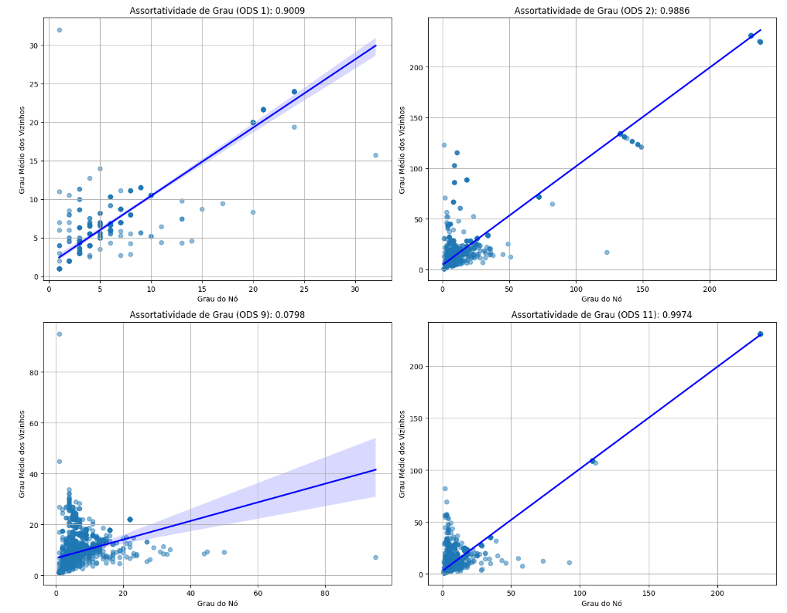

# Análise da assortatividade

> Realizando a análise sobre a assortatividade sobre os 4 grafos estudados

⬅️ [Readme principal](../u2t1.md)

 - Notebook com os códigos sobre os grafos.

## 🔄 Assortatividade

    

Analisando os gráficos da imagem acima, podemos levantar algumas conclusões sobre os autores dos artigos relacionados a cada ODS. Mas antes disso vamos definir algumas métricas importantes:

O valor da assortatividade pode está entre o intervalo de [-1, 1], sendo valores negativos atribuidos para a desassortatividade, que se define como a tendência de um nó da rede se relacionar com nós de graus diferentes do seu. Já valores positivos para a assortatividade, temos que um nó tende a se relacionar com outros nós de graus semelhantes ao seu.

Diante disso, podemos fazer uma interpretação para o estudo feito:

- **ODS 1, 2 e 11**: Nessas ODS`s o grau de assortatividade é alta, o que implica que autores com um alto grau de relevância, tendem a realizar trabalhos com outros pesquisadores de alta relevância. isso pode ser observado nos gráficos, onde a linha de tendência possui uma inclinação maior em relação a ODS 9, que possui um baixo grau de assortatividade. Podemos observar também a dispersão dos dados nos 3 gráficos, ao qual podemos ver uma incidência maior de elementos em torno da linha de tendência, isso está coerente já que o grau de assortatividade é alto, o número de autores que possuem graus próximos devem ser a maioria.

- **ODS 9**: Já nessa ODS, podemos observar um grau de assortatividade bastante baixo, onde os autores tendem a se relacionar mais com autores que possuiem graus de relevância diferentes do seu. Na disperção dos dados, podemos ver que há uma grande incidência de nós que estão associados com nós de graus diferentes do seu, estanddo fora da região delimitada pela linha de tendência.
