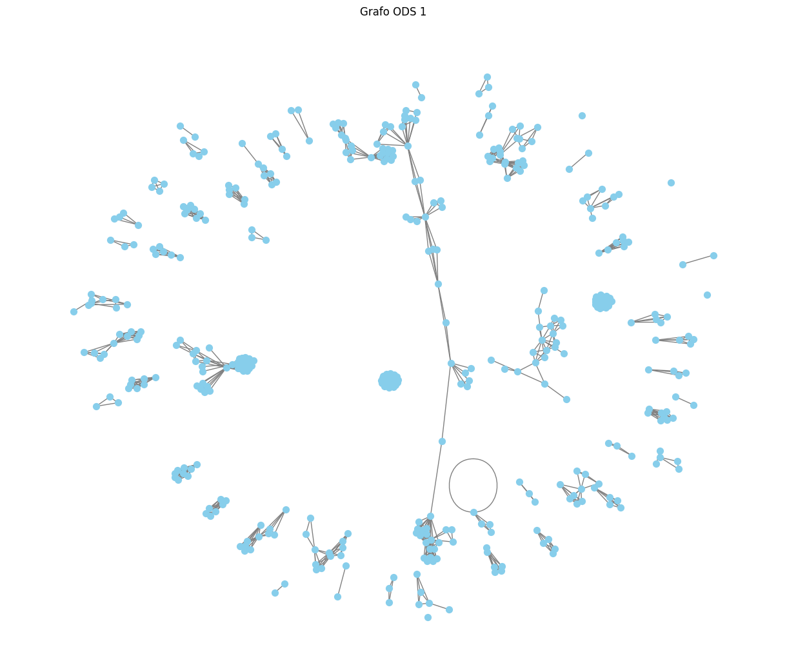
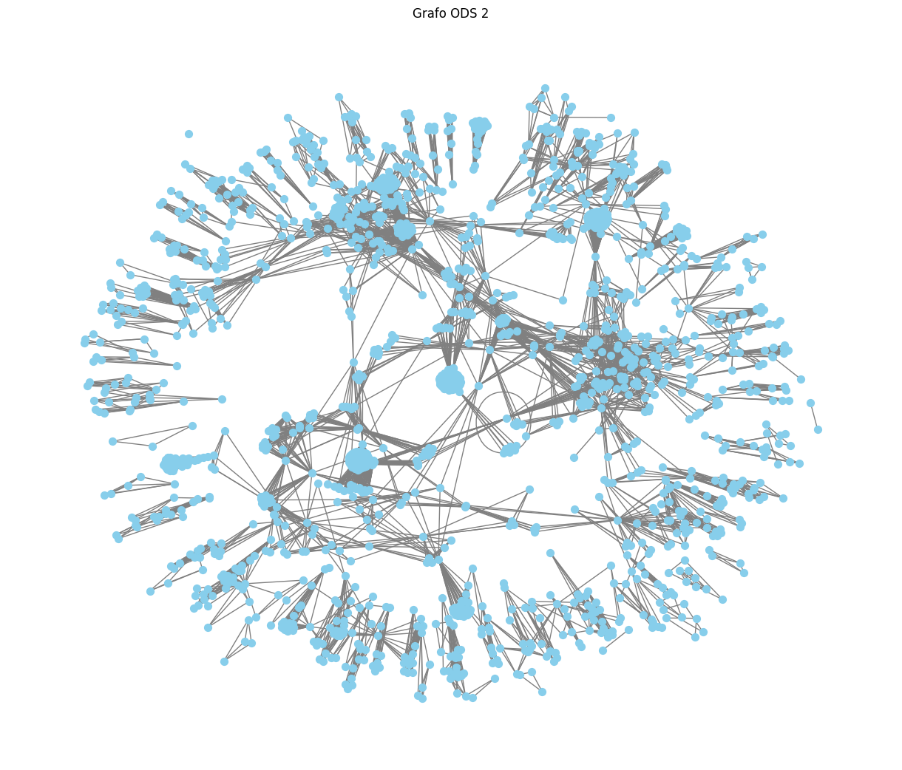
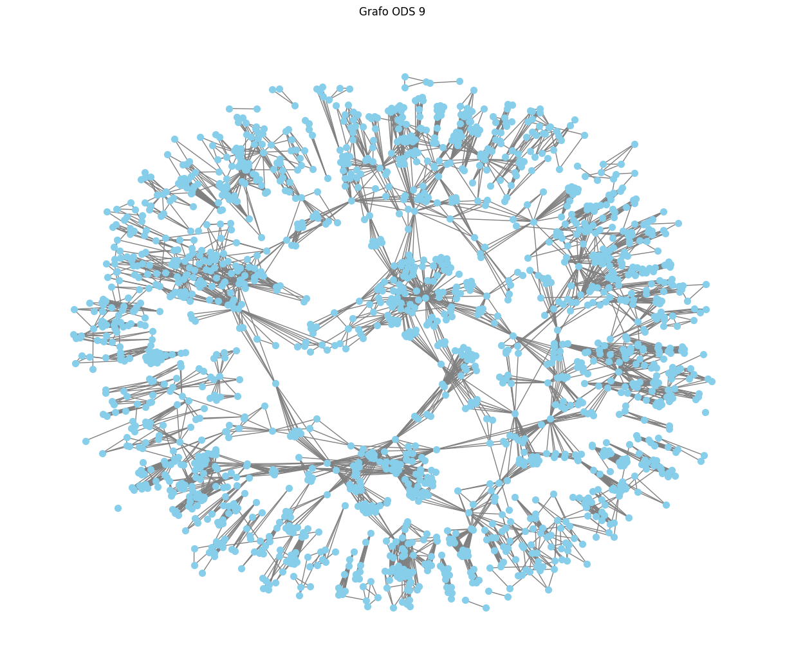
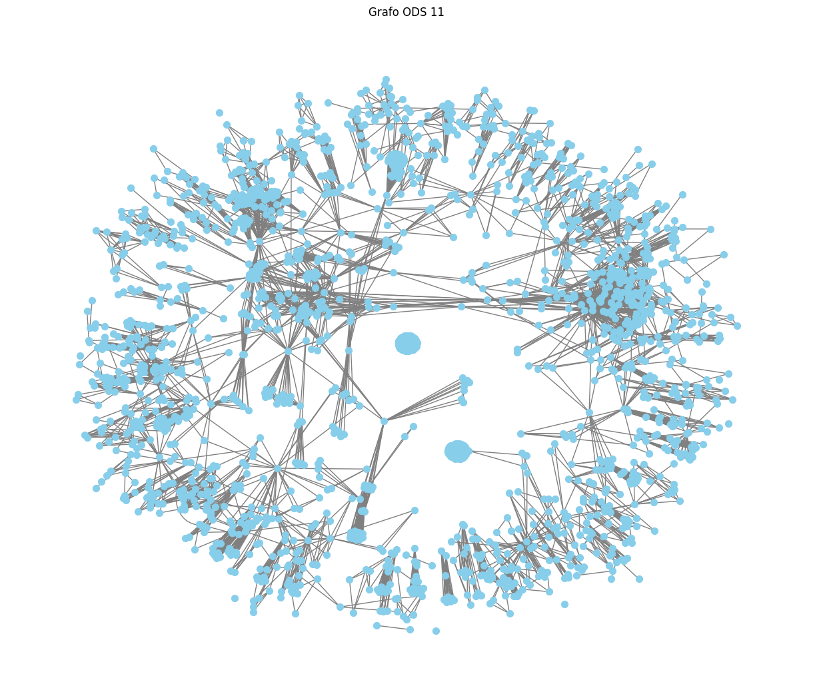
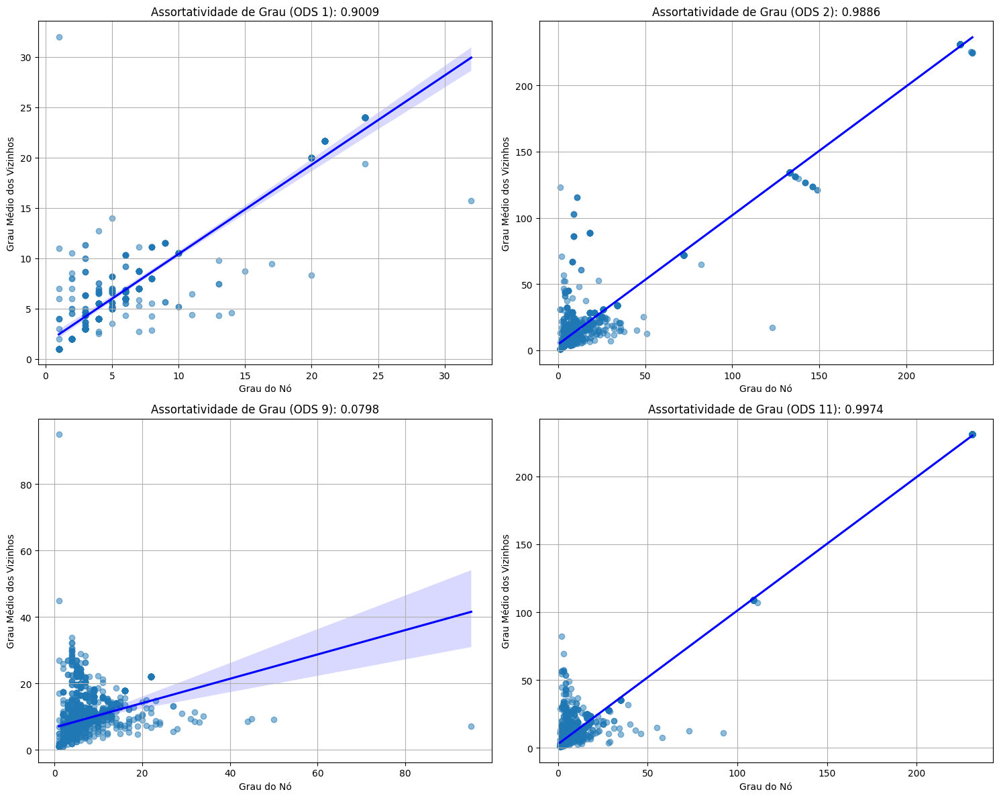

# Estudo da Assortatividade dos grafos de co-autoria da URFN relacionados as ODS


```python
!pip install networkx
!pip install pandas
!pip install matplotlib
!pip install seaborn
!pip install scipy
```

    Requirement already satisfied: networkx in /home/eduardo09/gabriel/ufrn/semestres/2024.1/aed2/aedii_dca0209/venv/lib/python3.12/site-packages (3.3)
    
    [notice] A new release of pip is available: 24.0 -> 24.1.2
    [notice] To update, run: pip install --upgrade pip
    Requirement already satisfied: pandas in /home/eduardo09/gabriel/ufrn/semestres/2024.1/aed2/aedii_dca0209/venv/lib/python3.12/site-packages (2.2.2)
    Requirement already satisfied: numpy>=1.26.0 in /home/eduardo09/gabriel/ufrn/semestres/2024.1/aed2/aedii_dca0209/venv/lib/python3.12/site-packages (from pandas) (2.0.1)
    Requirement already satisfied: python-dateutil>=2.8.2 in /home/eduardo09/gabriel/ufrn/semestres/2024.1/aed2/aedii_dca0209/venv/lib/python3.12/site-packages (from pandas) (2.9.0.post0)
    Requirement already satisfied: pytz>=2020.1 in /home/eduardo09/gabriel/ufrn/semestres/2024.1/aed2/aedii_dca0209/venv/lib/python3.12/site-packages (from pandas) (2024.1)
    Requirement already satisfied: tzdata>=2022.7 in /home/eduardo09/gabriel/ufrn/semestres/2024.1/aed2/aedii_dca0209/venv/lib/python3.12/site-packages (from pandas) (2024.1)
    Requirement already satisfied: six>=1.5 in /home/eduardo09/gabriel/ufrn/semestres/2024.1/aed2/aedii_dca0209/venv/lib/python3.12/site-packages (from python-dateutil>=2.8.2->pandas) (1.16.0)
    
    [notice] A new release of pip is available: 24.0 -> 24.1.2
    [notice] To update, run: pip install --upgrade pip
    Requirement already satisfied: matplotlib in /home/eduardo09/gabriel/ufrn/semestres/2024.1/aed2/aedii_dca0209/venv/lib/python3.12/site-packages (3.9.1)
    Requirement already satisfied: contourpy>=1.0.1 in /home/eduardo09/gabriel/ufrn/semestres/2024.1/aed2/aedii_dca0209/venv/lib/python3.12/site-packages (from matplotlib) (1.2.1)
    Requirement already satisfied: cycler>=0.10 in /home/eduardo09/gabriel/ufrn/semestres/2024.1/aed2/aedii_dca0209/venv/lib/python3.12/site-packages (from matplotlib) (0.12.1)
    Requirement already satisfied: fonttools>=4.22.0 in /home/eduardo09/gabriel/ufrn/semestres/2024.1/aed2/aedii_dca0209/venv/lib/python3.12/site-packages (from matplotlib) (4.53.1)
    Requirement already satisfied: kiwisolver>=1.3.1 in /home/eduardo09/gabriel/ufrn/semestres/2024.1/aed2/aedii_dca0209/venv/lib/python3.12/site-packages (from matplotlib) (1.4.5)
    Requirement already satisfied: numpy>=1.23 in /home/eduardo09/gabriel/ufrn/semestres/2024.1/aed2/aedii_dca0209/venv/lib/python3.12/site-packages (from matplotlib) (2.0.1)
    Requirement already satisfied: packaging>=20.0 in /home/eduardo09/gabriel/ufrn/semestres/2024.1/aed2/aedii_dca0209/venv/lib/python3.12/site-packages (from matplotlib) (24.1)
    Requirement already satisfied: pillow>=8 in /home/eduardo09/gabriel/ufrn/semestres/2024.1/aed2/aedii_dca0209/venv/lib/python3.12/site-packages (from matplotlib) (10.4.0)
    Requirement already satisfied: pyparsing>=2.3.1 in /home/eduardo09/gabriel/ufrn/semestres/2024.1/aed2/aedii_dca0209/venv/lib/python3.12/site-packages (from matplotlib) (3.1.2)
    Requirement already satisfied: python-dateutil>=2.7 in /home/eduardo09/gabriel/ufrn/semestres/2024.1/aed2/aedii_dca0209/venv/lib/python3.12/site-packages (from matplotlib) (2.9.0.post0)
    Requirement already satisfied: six>=1.5 in /home/eduardo09/gabriel/ufrn/semestres/2024.1/aed2/aedii_dca0209/venv/lib/python3.12/site-packages (from python-dateutil>=2.7->matplotlib) (1.16.0)
    
    [notice] A new release of pip is available: 24.0 -> 24.1.2
    [notice] To update, run: pip install --upgrade pip
    Requirement already satisfied: seaborn in /home/eduardo09/gabriel/ufrn/semestres/2024.1/aed2/aedii_dca0209/venv/lib/python3.12/site-packages (0.13.2)
    Requirement already satisfied: numpy!=1.24.0,>=1.20 in /home/eduardo09/gabriel/ufrn/semestres/2024.1/aed2/aedii_dca0209/venv/lib/python3.12/site-packages (from seaborn) (2.0.1)
    Requirement already satisfied: pandas>=1.2 in /home/eduardo09/gabriel/ufrn/semestres/2024.1/aed2/aedii_dca0209/venv/lib/python3.12/site-packages (from seaborn) (2.2.2)
    Requirement already satisfied: matplotlib!=3.6.1,>=3.4 in /home/eduardo09/gabriel/ufrn/semestres/2024.1/aed2/aedii_dca0209/venv/lib/python3.12/site-packages (from seaborn) (3.9.1)
    Requirement already satisfied: contourpy>=1.0.1 in /home/eduardo09/gabriel/ufrn/semestres/2024.1/aed2/aedii_dca0209/venv/lib/python3.12/site-packages (from matplotlib!=3.6.1,>=3.4->seaborn) (1.2.1)
    Requirement already satisfied: cycler>=0.10 in /home/eduardo09/gabriel/ufrn/semestres/2024.1/aed2/aedii_dca0209/venv/lib/python3.12/site-packages (from matplotlib!=3.6.1,>=3.4->seaborn) (0.12.1)
    Requirement already satisfied: fonttools>=4.22.0 in /home/eduardo09/gabriel/ufrn/semestres/2024.1/aed2/aedii_dca0209/venv/lib/python3.12/site-packages (from matplotlib!=3.6.1,>=3.4->seaborn) (4.53.1)
    Requirement already satisfied: kiwisolver>=1.3.1 in /home/eduardo09/gabriel/ufrn/semestres/2024.1/aed2/aedii_dca0209/venv/lib/python3.12/site-packages (from matplotlib!=3.6.1,>=3.4->seaborn) (1.4.5)
    Requirement already satisfied: packaging>=20.0 in /home/eduardo09/gabriel/ufrn/semestres/2024.1/aed2/aedii_dca0209/venv/lib/python3.12/site-packages (from matplotlib!=3.6.1,>=3.4->seaborn) (24.1)
    Requirement already satisfied: pillow>=8 in /home/eduardo09/gabriel/ufrn/semestres/2024.1/aed2/aedii_dca0209/venv/lib/python3.12/site-packages (from matplotlib!=3.6.1,>=3.4->seaborn) (10.4.0)
    Requirement already satisfied: pyparsing>=2.3.1 in /home/eduardo09/gabriel/ufrn/semestres/2024.1/aed2/aedii_dca0209/venv/lib/python3.12/site-packages (from matplotlib!=3.6.1,>=3.4->seaborn) (3.1.2)
    Requirement already satisfied: python-dateutil>=2.7 in /home/eduardo09/gabriel/ufrn/semestres/2024.1/aed2/aedii_dca0209/venv/lib/python3.12/site-packages (from matplotlib!=3.6.1,>=3.4->seaborn) (2.9.0.post0)
    Requirement already satisfied: pytz>=2020.1 in /home/eduardo09/gabriel/ufrn/semestres/2024.1/aed2/aedii_dca0209/venv/lib/python3.12/site-packages (from pandas>=1.2->seaborn) (2024.1)
    Requirement already satisfied: tzdata>=2022.7 in /home/eduardo09/gabriel/ufrn/semestres/2024.1/aed2/aedii_dca0209/venv/lib/python3.12/site-packages (from pandas>=1.2->seaborn) (2024.1)
    Requirement already satisfied: six>=1.5 in /home/eduardo09/gabriel/ufrn/semestres/2024.1/aed2/aedii_dca0209/venv/lib/python3.12/site-packages (from python-dateutil>=2.7->matplotlib!=3.6.1,>=3.4->seaborn) (1.16.0)
    
    [notice] A new release of pip is available: 24.0 -> 24.1.2
    [notice] To update, run: pip install --upgrade pip
    Collecting scipy
      Using cached scipy-1.14.0-cp312-cp312-manylinux_2_17_x86_64.manylinux2014_x86_64.whl.metadata (60 kB)
    Requirement already satisfied: numpy<2.3,>=1.23.5 in /home/eduardo09/gabriel/ufrn/semestres/2024.1/aed2/aedii_dca0209/venv/lib/python3.12/site-packages (from scipy) (2.0.1)
    Using cached scipy-1.14.0-cp312-cp312-manylinux_2_17_x86_64.manylinux2014_x86_64.whl (40.8 MB)
    Installing collected packages: scipy
    Successfully installed scipy-1.14.0
    
    [notice] A new release of pip is available: 24.0 -> 24.1.2
    [notice] To update, run: pip install --upgrade pip


```python
import networkx as nx
import pandas as pd
import matplotlib.pyplot as plt
import seaborn as sns
import scipy
```


```python
# Criando funções auxialiares

def create_graph(dataframe):
    """
        função para criar o grafo de co-autoria

        args:
            - dataframe: dataframe relacionado a ODS
            
        return:
            - graph: grafo de co-autoria
    """
    graph = nx.Graph()

    for index, row in dataframe.iterrows():
        autores = row["Authors"].split(";")
        for autor in autores:
            # criando os nós do grafo sobre a ods_1
            graph.add_node(autor)
    
        for i, autor1 in enumerate(autores):
            for j, autor2 in enumerate(autores):
                if j != i:
                    graph.add_edge(autor1,autor2)
        
    return graph

def plot_graph(graph,titulo, mode="spring"):
    """
        função para plotar o grafo

        args:
            - graph: grafo a ser plotado
            - titulo: titulo da imagem do grafo a ser plotado
            - mode: tipo de visualização que o grafo será visualizado (spring,circular,kamada)

        return:
            - None
    """
    # Plotando o grafo com um layout diferente
    plt.figure(figsize=(12, 10))
    
    # Experimente diferentes layouts: spring_layout, circular_layout, kamada_kawai_layout
    if mode == "spring":
        pos = nx.spring_layout(graph, k=0.1)  # Ajuste o parâmetro 'k' conforme necessário
    elif mode == "circular":
        pos = nx.circular_layout(graph)
    elif mode == "kamada":
        pos = nx.kamada_kawai_layout(graph)
    
    # Ajustando estilos
    nx.draw(graph, pos, with_labels=False, node_size=50, node_color="skyblue", font_size=8, font_weight="bold", edge_color="gray", width=1, alpha=1)
    plt.title(titulo)
    plt.show()

def calculate_graph_metrics(G):
    """
        Função para calcular as metricas de um grafo

        args:
            - G: grafo a ser usado para recuperar as metricas

        return:
            - metrics: metricas obtidas do grafo passado como argumento
    """
    metrics = {}
    metrics['num_nodes'] = G.number_of_nodes()
    metrics['num_edges'] = G.number_of_edges()
    metrics['average_degree'] = sum(dict(G.degree()).values()) / G.number_of_nodes()
    metrics['density'] = nx.density(G)
    metrics['assortativity'] = nx.degree_assortativity_coefficient(G)
    metrics['average_clustering'] = nx.average_clustering(G)
    return metrics

def plot_degree_assortativity(G, title, ax):
    """
        Função para calcular a assortatividade em relação ao grau dos nós

        args:
            - G: grafo a ser trabalhado
            - title: nome da ODS que será apresentado no titulo
            - ax: lista que indicará a posição em que o gráfico ficará no grid. ex: [0,0] - canto superior esquerdo

        return:
            - None;
    """
    degree = dict(G.degree())
    degree_assortativity = nx.degree_assortativity_coefficient(G)

    x = []
    y = []

    for node in G.nodes():
        neighbors = list(G.neighbors(node))
        if len(neighbors) > 0:
            avg_neighbor_degree = sum(degree[neighbor] for neighbor in neighbors) / len(neighbors)
            x.append(degree[node])
            y.append(avg_neighbor_degree)

    sns.regplot(x=x, y=y, scatter_kws={'alpha':0.5}, line_kws={'color':'blue'}, ax=ax)
    ax.set_xlabel('Grau do Nó')
    ax.set_ylabel('Grau Médio dos Vizinhos')
    ax.set_title(f'Assortatividade de Grau ({title}): {degree_assortativity:.4f}')
    ax.grid(True)
```

## GRAFO ODS 1 - Erradicação da Pobreza


```python
# obtendo o dataframe da ods_1
data_frame1 = pd.read_csv('../datasets/ods_1.csv')

# criando o grafo da ods_1
ods1_graph = create_graph(data_frame1)

# metricas do grafo
metrics_ods1_graph = calculate_graph_metrics(ods1_graph)
print(f'metricas do grafo ODS 1 = \n {metrics_ods1_graph}')

# plotando o grafo
plot_graph(ods1_graph, titulo="Grafo ODS 1")
```

    metricas do grafo ODS 1 = 
     {'num_nodes': 432, 'num_edges': 1622, 'average_degree': 7.5092592592592595, 'density': 0.0174228753115064, 'assortativity': 0.9009291378661549, 'average_clustering': 0.8827279495589044}


    

    


## GRAFO ODS 2 - Fome Zero e Agricultura Sustentável


```python
# obtendo o dataframe da ods_1
data_frame2 = pd.read_csv('../datasets/ods_2.csv')

# criando o grafo da ods_1
ods2_graph = create_graph(data_frame2)
        
# metricas do grafo
metrics_ods2_graph = calculate_graph_metrics(ods2_graph)
print(f'metricas do grafo ODS 2 = \n {metrics_ods2_graph}')

# plotando o grafo
plot_graph(ods2_graph, titulo="Grafo ODS 2")
```

    metricas do grafo ODS 2 = 
     {'num_nodes': 1869, 'num_edges': 45126, 'average_degree': 48.28892455858748, 'density': 0.0258506020120918, 'assortativity': 0.9886121325908488, 'average_clustering': 0.945776740244136}


    

    


## GRAFO ODS 9: Indústria, Inovação e Infraestrutura


```python
# obtendo o dataframe da ods_1
data_frame9 = pd.read_csv('../datasets/ods_9.csv')

# criando o grafo da ods_1

ods9_graph = create_graph(data_frame9)
        
# metricas do grafo
metrics_ods9_graph = calculate_graph_metrics(ods9_graph)
print(f'metricas do grafo ODS 9 = \n {metrics_ods9_graph}')

# plotando o grafo
plot_graph(ods9_graph, titulo="Grafo ODS 9")
```

    metricas do grafo ODS 9 = 
     {'num_nodes': 1825, 'num_edges': 6119, 'average_degree': 6.7057534246575345, 'density': 0.0036763999038692623, 'assortativity': 0.0797726633617647, 'average_clustering': 0.9100807926418003}


    

    


## GRAFO ODS 11: Cidades e Comunidades Sustentáveis


```python
# obtendo o dataframe da ods_1
data_frame11 = pd.read_csv('../datasets/ods_11.csv')

# criando o grafo da ods_1
ods11_graph = create_graph(data_frame11)
        
# metricas do grafo
metrics_ods11_graph = calculate_graph_metrics(ods11_graph)
print(f'metricas do grafo ODS 11 = \n {metrics_ods11_graph}')

# plotando o grafo
plot_graph(ods11_graph, titulo="Grafo ODS 11")
```

    metricas do grafo ODS 11 = 
     {'num_nodes': 2095, 'num_edges': 39679, 'average_degree': 37.879713603818615, 'density': 0.018089643554832193, 'assortativity': 0.9974342960857882, 'average_clustering': 0.9115389619743167}


    

    


## Obtendo o gráfico bipartido sobre a assortatividade em relação ao grau dos nós da rede


```python
# Criar um layout de grid para os gráficos de dispersão
fig, axs = plt.subplots(2, 2, figsize=(15, 12))

# Plotar cada ODS
plot_degree_assortativity(ods1_graph, "ODS 1", axs[0, 0])
plot_degree_assortativity(ods2_graph, "ODS 2", axs[0, 1])
plot_degree_assortativity(ods9_graph, "ODS 9", axs[1, 0])
plot_degree_assortativity(ods11_graph, "ODS 11", axs[1, 1])

plt.tight_layout()
plt.show()
```


    

    

