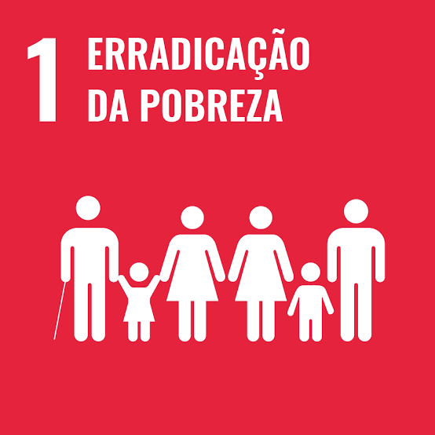
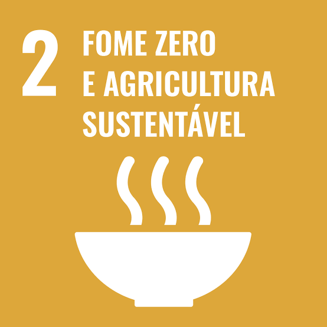
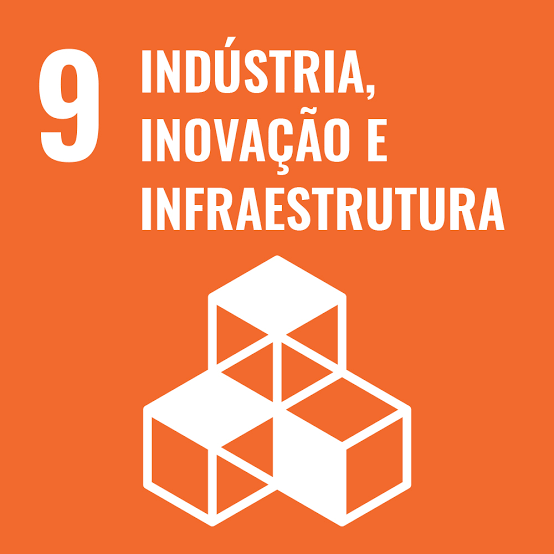
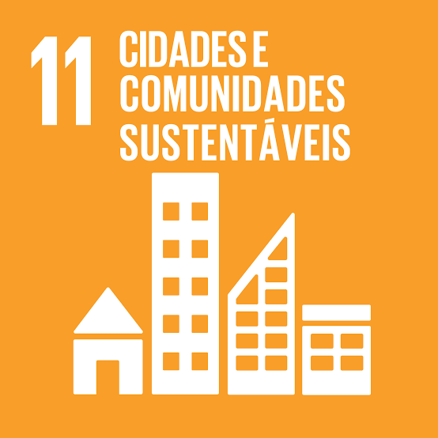

# U2T1 - Investigando redes de co-autoria e ODS-ONU

Atividade realizada por:
- **Aluno**: [Carlos Gabriel Medeiros da Silva](https://github.com/CarlosG18) **matricula**: 20230093859

## [1/6] 🎯 Objetivo da Atividade

O objetivo deste trabalho é criar uma **rede de co-autoria** baseada em artigos científicos da **UFRN**, utilizando dados obtidos da plataforma [Scopus](). Cada vértice na rede representa um autor identificado pelo seu ID Scopus, nome e afiliação institucional (e.g., UFRN, UFPB, Petrobras). A análise focará em investigar as redes de co-autoria relacionadas aos **Objetivos de Desenvolvimento Sustentável (ODS)** da ONU.

### 🤔 Para que esse estudo se aplicaria? 

temos vários pontos que se podem ser trabalhados com esse estudo, são eles:

- **Identificação de Colaborações Científicas**: Revelar padrões de colaboração entre pesquisadores.

- **Impacto nos ODS**: Identificar quais áreas de pesquisa estão alinhadas com os Objetivos de Desenvolvimento Sustentável.

- **Assortatividade e Qualidade da Pesquisa**: Avaliar se pesquisadores de alto impacto colaboram entre si, indicando a qualidade da pesquisa.

- **Desenvolvimento Institucional**: Informar decisões sobre contratações e financiamento na instituição.

- **Interdisciplinaridade**: Revelar o grau de colaboração entre diferentes áreas do conhecimento.

- **Políticas de Pesquisa**: Auxiliar na criação de políticas que incentivem colaborações estratégicas.

- **Comunicação e Visibilidade**: Aumentar a visibilidade e a comunicação científica do trabalho realizado.

## [2/6] ✅ Requisito 1 - Escolhendo 4 ODS/SDG

Neste requisito, foram escolhidos quatro ODS/SDG para o estudo:

    
    
    
    

- **ODS 1: Erradicação da Pobreza**
  - **Objetivo**: Acabar com a pobreza em todas as suas formas e em todos os lugares.
  - **Importância**: Visa garantir que todas as pessoas, especialmente as mais vulneráveis, tenham acesso a recursos econômicos, serviços básicos e segurança social.

- **ODS 2: Fome Zero e Agricultura Sustentável**
  - **Objetivo**: Acabar com a fome, alcançar a segurança alimentar, melhorar a nutrição e promover a agricultura sustentável.
  - **Importância**: Envolve aumentar a produtividade agrícola, assegurar sistemas sustentáveis de produção de alimentos e melhorar a nutrição.

- **ODS 9: Indústria, Inovação e Infraestrutura**
  - **Objetivo**: Construir infraestruturas resilientes, promover a industrialização inclusiva e sustentável e fomentar a inovação.
  - **Importância**: Enfatiza a construção de infraestruturas de qualidade, promoção da inovação e suporte ao desenvolvimento industrial para impulsionar o crescimento econômico e a criação de empregos.

- **ODS 11: Cidades e Comunidades Sustentáveis**
  - **Objetivo**: Tornar as cidades e os assentamentos humanos inclusivos, seguros, resilientes e sustentáveis.
  - **Importância**: Foca na melhoria da urbanização, garantindo acesso a habitação segura e acessível, sistemas de transporte acessíveis e a redução do impacto ambiental das cidades.

## [3/6] ✅ Requisito 2 - Análise da Assortatividade

A assortatividade em redes é uma medida que avalia a tendência de nós se conectarem com outros nós que possuem graus semelhantes. Em termos de redes de co-autoria, isso significa avaliar se autores altamente produtivos tendem a colaborar mais frequentemente com outros autores altamente produtivos.Para cada uma das redes relacionadas aos ODS escolhidos, será feita uma análise da assortatividade em relação ao grau dos nós:

- [📊 Análise da assortatividade](./assortatividade.md)

## [4/6] ✅ Requisito 3 - Tabela de Caracteristicas da Rede

## [5/6] 🎥 Video Explicativo
O video Explicativo desta atividade se encontra [aqui]()

## [6/6] Algumas conclusões Finais sobre o estudo

