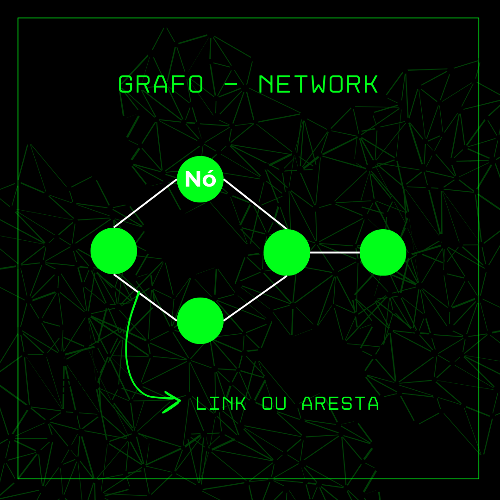
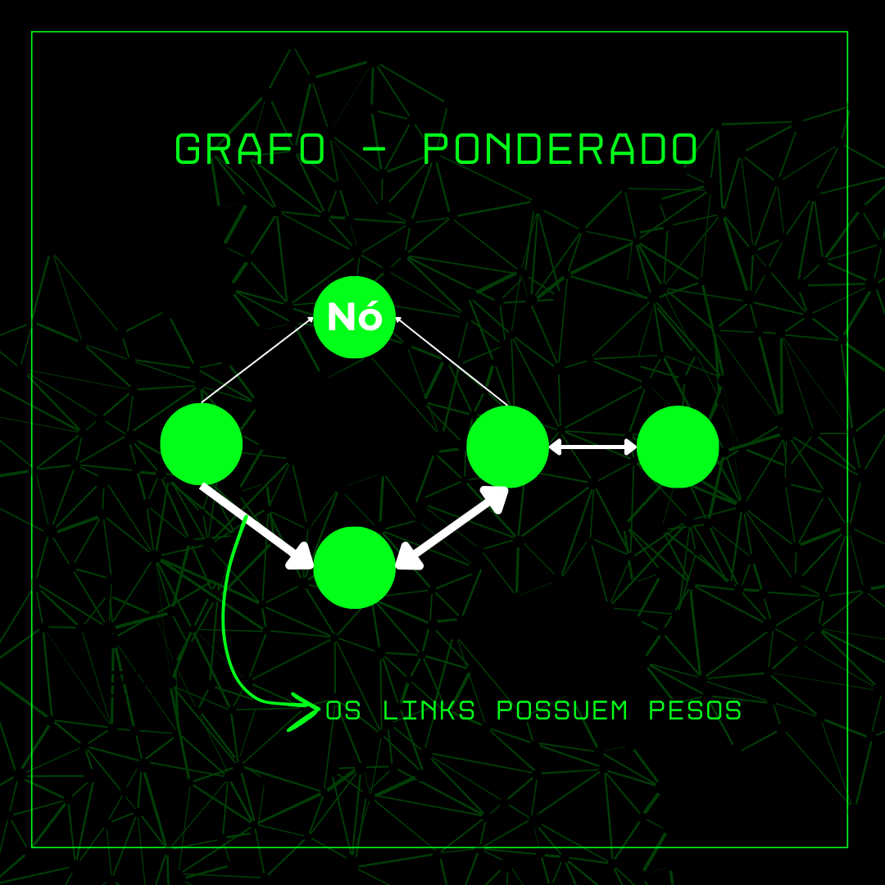
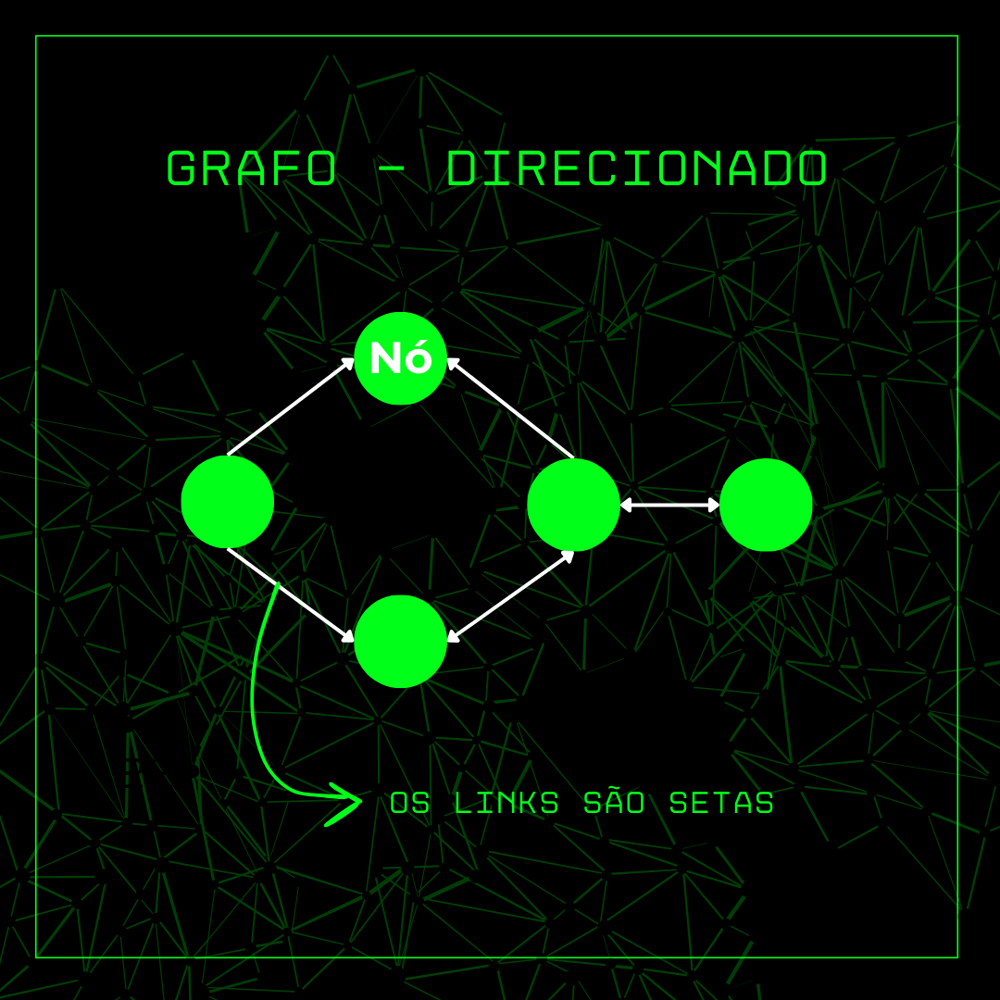
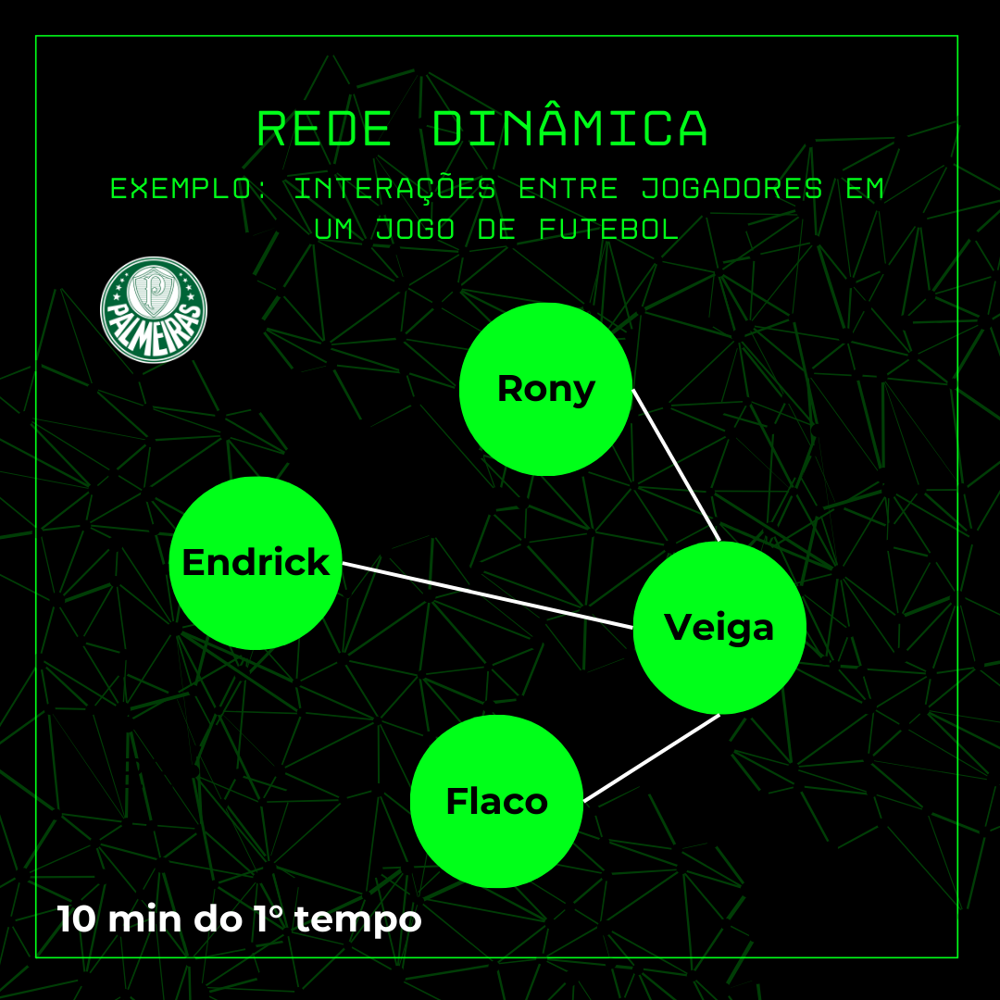
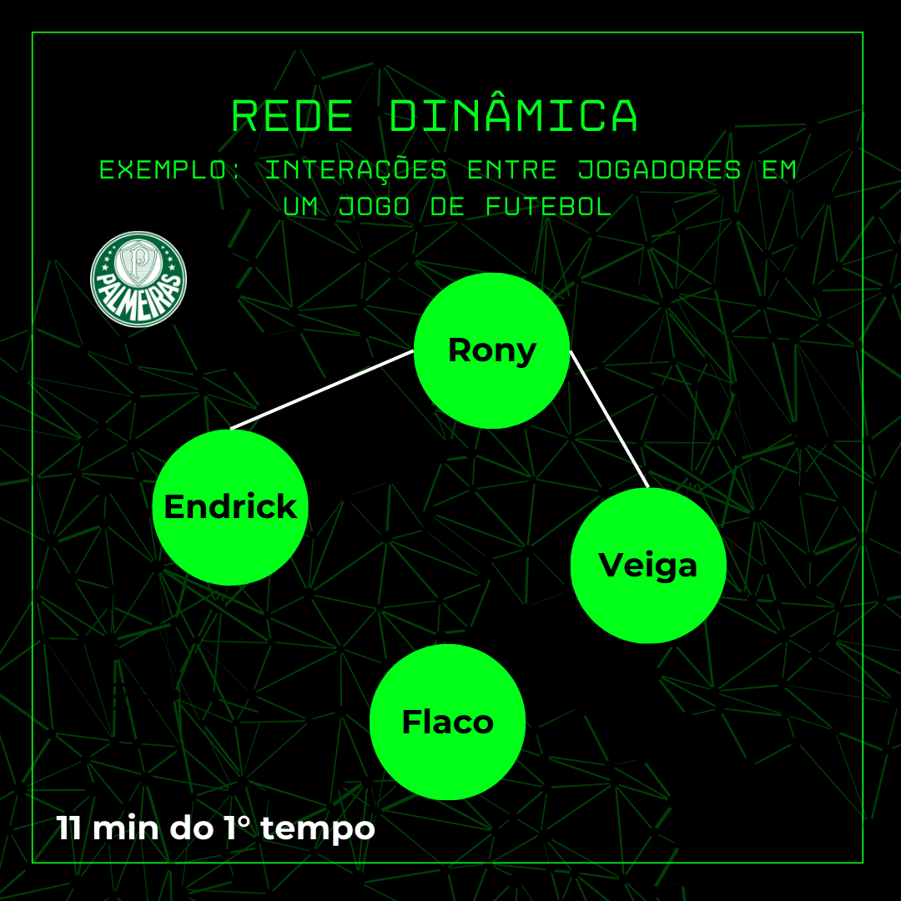
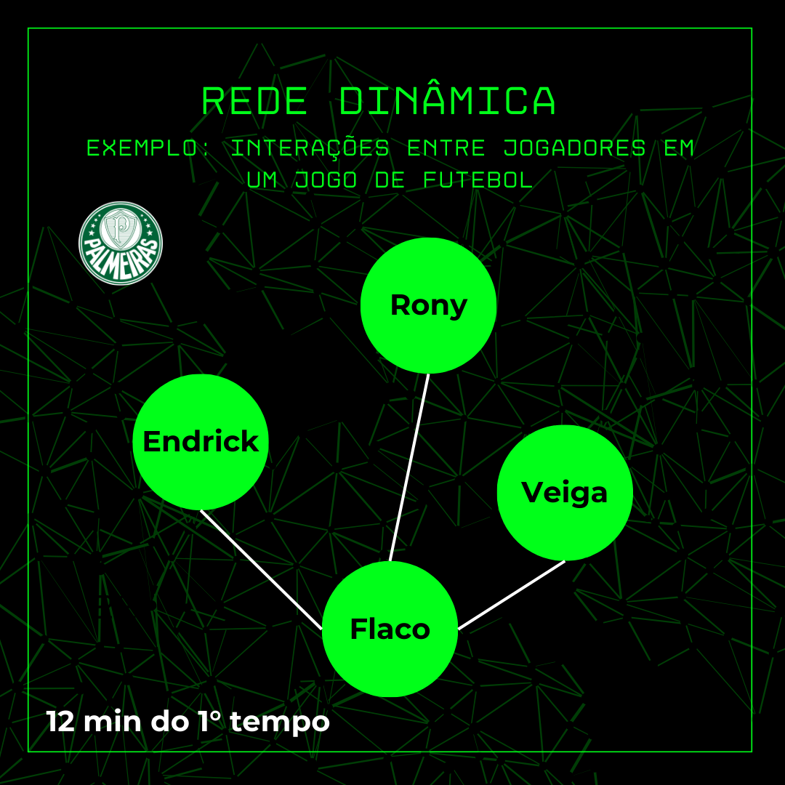
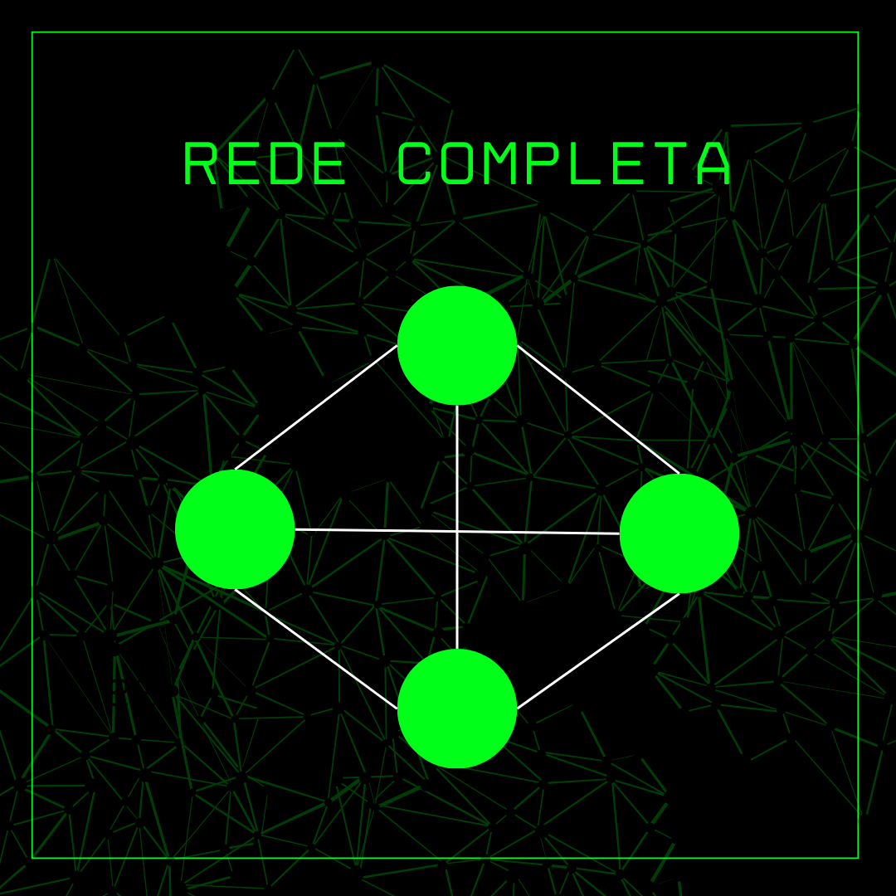
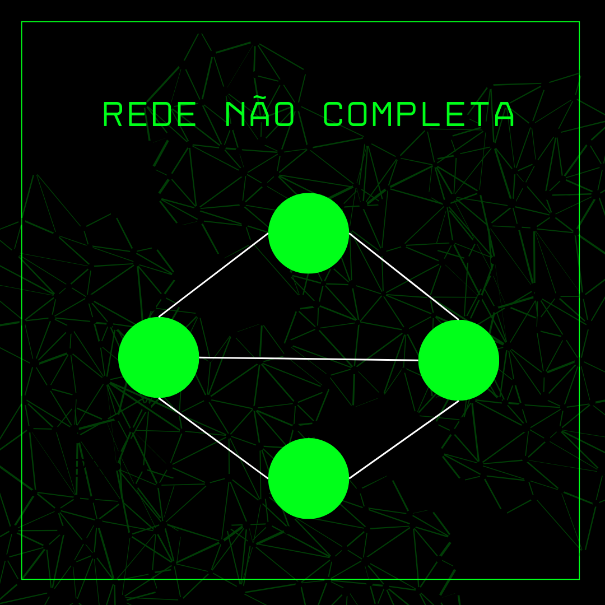
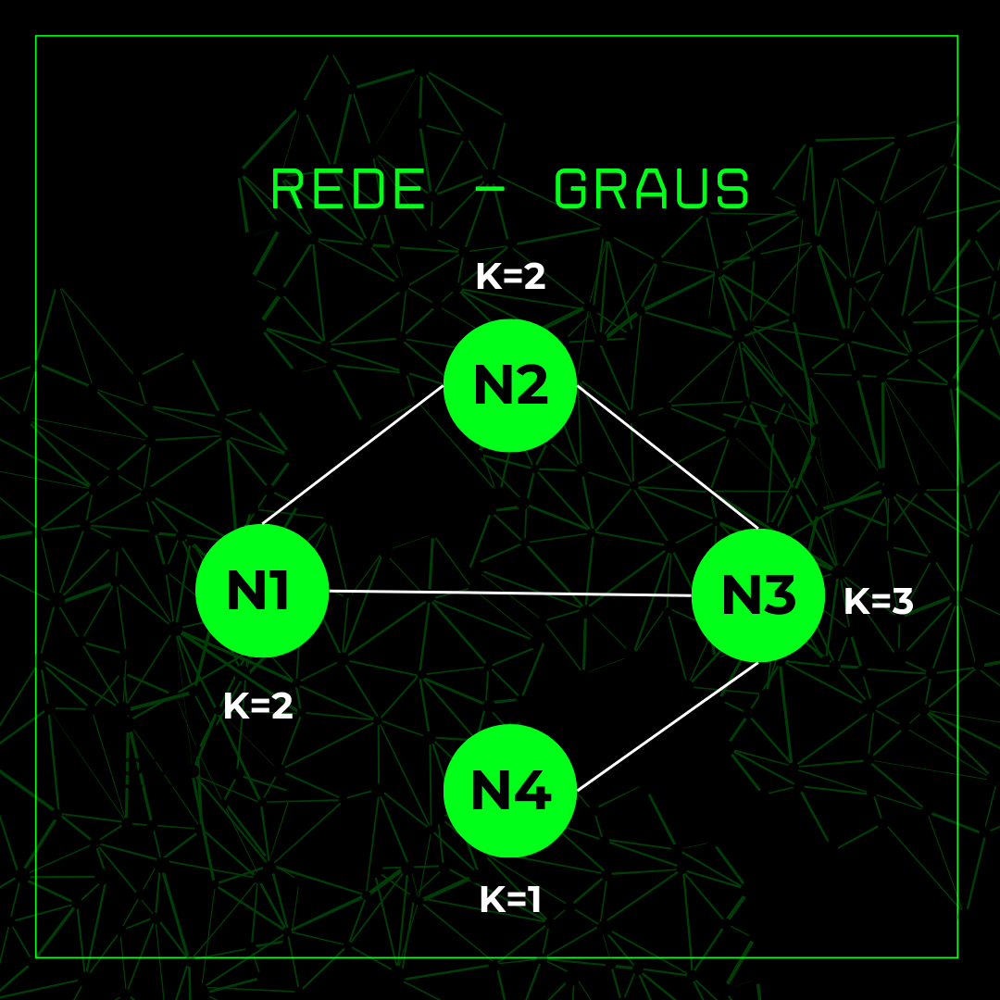
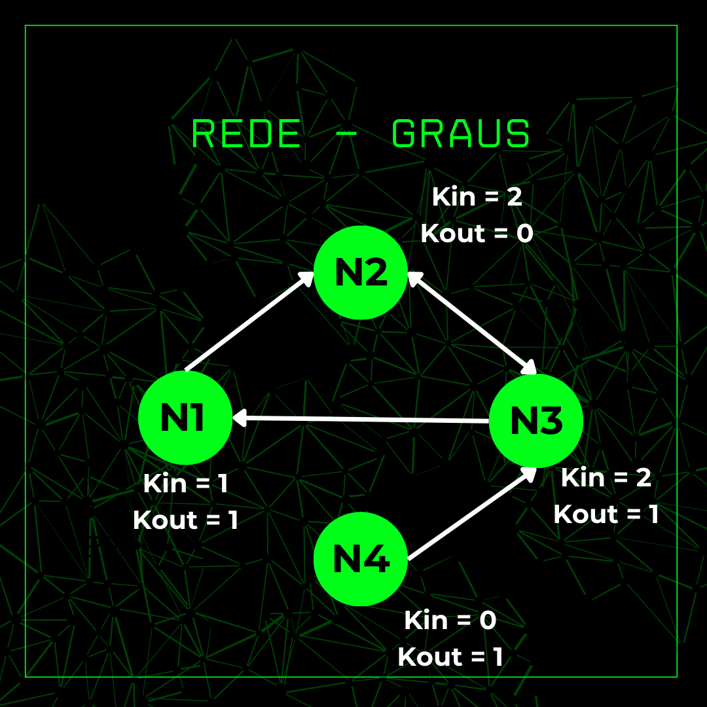

# Grafos (Network)

> informações e conteúdos sobre a estrutura de dados: GRAFO

## [1/4] 📝 Conceitos básicos

### ❔ O que é um grafo? 

Um grafo é uma estrutura de dados usada para modelar um conjunto de objetos, chamados de **vértices (ou nós)**, que estão conectados por meio de **arestas (ou links)**. Os **vértices** são representados por círculos, enquanto as **arestas** representam as relações entre os vértices e são representadas por linhas. Portanto, os vértices são os elementos individuais do grafo, e as arestas são as conexões entre esses elementos.. A imagem a seguir exemplifica um grafo:

    

### 🔶 Formas de um grafo:

Podemos também representar algumas caracteriscas do problema fazendo algumas modelagens visuais no grafo. Temos os grafos direcionados e os grafos ponderados. Os **grafos ponderados**, possuem pesos em seus links (representado pela espessura do link na imagem abaixo). Já os grafos direcionados, os links possuem direções (representados por setas). Podemos também combinar esses dois tipos de grafos dependendo da modelagem do nosso problema.

    
    

A imagem apresentada na esquerda mostra um grafo que ao mesmo tempo é ponderado e dirigido, enquanto a imagem da direita mostra um grafo apenas um grafo dirigido/direcionado.

## [2/4] 🔵 Tipos de Redes:

### 📌 Rede bipartida

Uma rede bipartida é uma rede que possui dos grupos de objetos distintos mais que possuem alguma relação. É importante observar que neste tipo de rede, elementos do mesmo grupo não possuem qualquer relação. vamos analisar um exemplo prático para ficar mais claro:

    

Observando a rede acima, percebemos que o grupo **países** não possui qualquer relacionamento entre seus elementos. Da mesma forma, o grupo **produtos** também não se relaciona entre si. No entanto, notamos que o grupo "países" pode se relacionar com vários produtos, assim como os produtos podem se relacionar com vários países.

### 📌 Rede Multicamada

Em uma rede multicamada, cada tipo de relacionamento é representado por uma camada diferente. Cada camada mostra como os nós estão conectados de acordo com um tipo específico de interação ou relacionamento. podemos ver um exemplo de rede multicamada abaixo:

    

Temos um exemplo de interções em uma festa. Nela vemos que pessoas podem se relacionar de três formas (camadas), com interações visuais (olhares), interações verbais (conversas) e interações fisicas (aperto de maõs, abraços, etc). Perceba que para cada camada uma cor é usada para diferenciação entre os verticies.

### 📌 Rede Dinâmica

Uma Rede Dinâmica é uma rede em que a forma como ela esta definida varia de acordo com o tempo. veja o exemplo abaixo para ficar mais claro:

    
    
    

## [3/4] 🔍 Propriedades de um Grafo

### 📌 Rede Completa

Uma rede é definida como completa quando todos os nós são conectados atraveś de links entre si:

    
    

### 📌 Densidade

O cálculo da densidade de uma rede está associada ao total de links máximos da rede e dos links que realmente estão conectados. Vamos analisar como calcular o links máximos:

- **Rede sem ser direcionado**: para calcularmos o número máximo de links, basta multiplicar o número de nós (no caso N) pela quantidade de ligações que um nó pode fazer (vamos desconsiderar que ele faça uma ligação com si próprio) então temos **N-1** nós. Como a ligação do nó A - B e B - A é considerada a mesma, devemos dividir isso tudo por 2. temos a expressão para isso dado abaixo:

$$
\begin{equation}
\begin{aligned}
L_{máx} &= \frac{N(N-1)}{\text{2}} \\
\end{aligned}
\end{equation}
$$

- **Rede direcionada**: Já para uma rede direcionada, como o link **A -> B** e **B -> A** são diferentes, não precisamos dividir a expressão **N(N-1)** por 2:

$$
\begin{equation}
\begin{aligned}
L_{máx-direcionada} &= N(N-1) \\
\end{aligned}
\end{equation}
$$

Com as fórmulas dos links máximos obtidos, podemos definir a **desidade** (D) de uma rede como sendo a seguinte razão:

$$
\begin{equation}
\begin{aligned}
D &= \frac{L}{L_{\text{máx}}} \\
\end{aligned}
\end{equation}
$$

sendo:

- **L**: número de links da rede;
- **Lmáx**: número máximo de links que a rede pode ter;

### 📌 Grau (degree)

A definição de Grau está relacionada aos nós da rede. definimos grau como a quantidade arestas que esse nó possui. vamos ver um exemplo:

    
    

Podemos observar a imagem a esquerda (rede sem direcionamento) que os graus de cada nó são dados pela constante **k**. Comparando com a imagem da direita (rede direcionada) podemos ver que o **k** se decomponhe em duas novas variaveis, o **Kin**, que representa todas as setas que estão entrado no nó, e o **kout**, que representa todas as setas que estão saindo do nó. O **grau médio** de uma rede é definido por:

$$
\begin{equation}
\begin{aligned}
<k> &= \frac{\sum_{i=0}^{N}K_{i}}{\text{N}} \\
\end{aligned}
\end{equation}
$$

### 📌 Subrede

Uma subrede é uma rede composta por elementos obtidos de uma rede "pai"., ou seja, é uma parte distinta de uma rede maior que foi separada para análise ou implementação separada.

## [4/4] 👁️ Forma de representação de grafos

Existem algumas formas de representar as rede, são elas:

### 📌 matriz de adjacencia

Vamos usar a rede que foi ultilizada para definir o grau:

  

podemos representa-lá pela seguinte matriz de adjacência:

<table style="width:100%; border: 1px solid black; border-collapse: collapse;text-align: center;">
  <thead>
    <tr>
      <th></th>
      <th>N1</th>
      <th>N2</th>
      <th>N3</th>
      <th>N4</th>
    </tr>
  </thead>
  <tbody>
    <tr>
      <th>N1</th>
      <td>0</td>
      <td>1</td>
      <td>0</td>
      <td>0</td>
    </tr>
    <tr>
      <th>N2</th>
      <td>0</td>
      <td>0</td>
      <td>1</td>
      <td>0</td>
    </tr>
    <tr>
      <th>N3</th>
      <td>1</td>
      <td>1</td>
      <td>0</td>
      <td>0</td>
    </tr>
    <tr>
      <th>N4</th>
      <td>0</td>
      <td>0</td>
      <td>1</td>
      <td>0</td>
    </tr>
  </tbody>
</table>

Mas como foi feita essa matriz? bom para completar essa matriz, basta analisar nó por nó. Por se tratar de uma rede direcionada, devemos observar o sentido da seta na hora de completar a matriz. como por exemplo o nó **N1**:

- **N1 -> N1**: como a rede não possui nenhuma seta que saia de N1 e volte para o próprio N1, colocamos 0.
- **N1 -> N2**: já nessa situação, podemos ver que existe uma seta que sai do N1 para o nó N2. portanto completamos com 1.

e deste modo fazemos a mesma analise para o restante do nó N1 e para os outros nós que faltam.