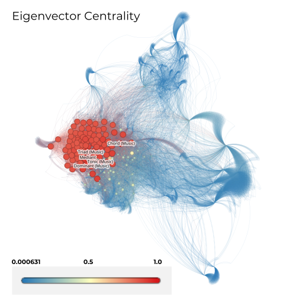

# Analizando algumas métricas do grafo

 - Notebook com a obtenção das métricas

## Usando o Gephi

## Degree Centrality, Closeness Centrality, Betweenness Centrality e Eigenvector Centrality

filtros:
Eigenvector Centrality: 0.923 - 1.0
Closeness Centrality:  1.0
Betweenness Centrality: 66086.99196767087 --- 165217.47991917716
Degree Centrality: 604 -- 1005

    
    

    
    

### Algumas interpretações e observações sobre as imagens das métricas acima
