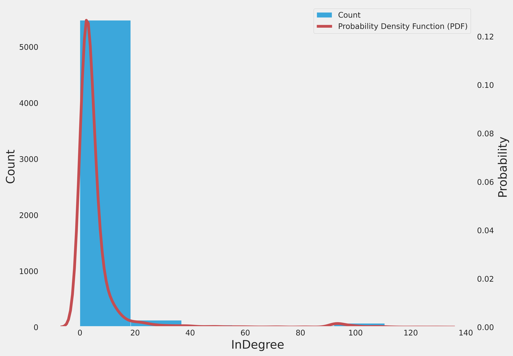
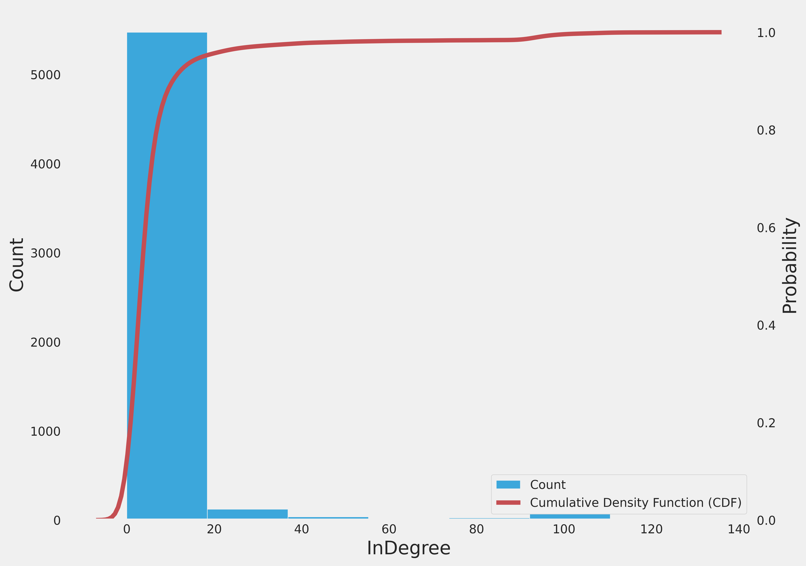

# Analisando o In-Degree dos vérticies

 - Notebook com a obtenção das métricas do In-Degree

## 🔶 In-Degree

Basicamente como o grafo obtido pelo estudo é um grafo direcionado, ele possui tanto o **in-degree**, que está ligado ao número de páginas que citam aquela página em especifico e o **out-degree** que são as páginas que que uma determinada página cita. vamos estudar mais profundamente a métrica do Indegree por ser mais relevante para o estudo.

    
    

### 🔍 Algumas interpretações e observações sobre as imagens das métricas acima

#### 🔹PDF (Função de densidade de probabilidade)

Podemos observar que a PDF consegue, de certo modo, seguir bem o que o histograma apresenta. Podemos notar que a maioria dos nós possui uma probabilidade alta de ter o valor do indegree na faixa de 0 a 20. Outro ponto interessante é que, à direita, a PDF possui uma cauda longa, indicando que, embora a maioria dos dados esteja concentrada em indegrees baixos, existem valores atípicos para o indegree, como em alguns casos ultrapassando 100.

#### 🔹CDF (Função de Distribuição Acumulada)

Ao analisar a CDF, podemos observar que há um crescimento muito rápido nos valores iniciais para o indegree, sugerindo que uma alta porcetagem de páginas possui o indegree em uma regiao especifica (0 a 20) indicando que a a maioria das páginas possui um indegree baixo, ao qual pode se confirmar na estabilização da CDF. Apesar da estabilização da CDF, há uma pequena porcentagem de nós com InDegree muito alto (acima de 60 e até 100). Estes são os outliers ou valores atípicos que, embora sejam poucos, existem e são importantes em certos contextos de análise. Com a CDF, podemos saber a proporção de nós com um InDegree menor ou igual a um determinado valor, como a CDF atinge 1 (ou 100%) muito rapidamente, isso reforça que os InDegrees elevados são extremamente raros.
