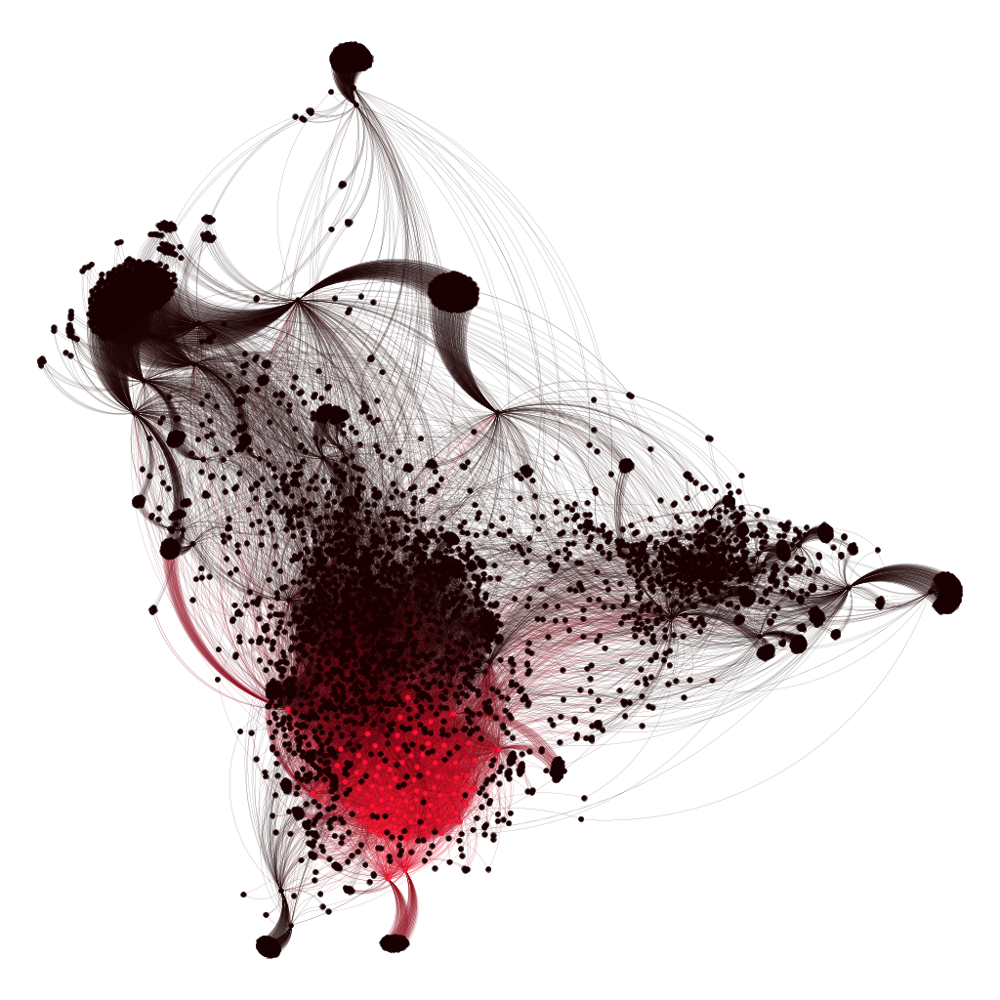

# Analisando o Core Decomposition

 - Notebook com a obtenção das métricas do Core Decomposition

## 🔶 Decomposition

O grafo pode ser subdivido em camadas em relação aos links que cada nó possui, ou seja, existe uma subestrutura do grafo onde cada nó tem pelo menos k conexões (arestas) com outros nós dentro dessa subestrutura, essa subestrutura recebe o nome de k-core.

    

<b>imagem do 154-core do grafo</b>

### 🔍 Algumas interpretações e observações sobre as imagens do Core Decomposition

Na imagem podemos ver uma região que está associada ao **154-core** do grafo, ou seja, esse grupo de páginas possuem pelo menos 154 conexões com outras páginas do grafo. Isso indica um Hub com forte interconexão, representando uma estrutura coesa e densa do grafo. Analisando algumas páginas individualmente através do notebook acima (recorte de apenas 10 páginas) que possuem o 154-core:

| ID| página                      |
|:-:|:---------------------------:|
| 1 | **Mixed-Interval Chord**    |
| 2 | Tone Cluster                |
| 3 | **Mystic Chord**            |
| 4 | Secondary Dominant          |
| 5 | Quartal And Quintal Harmony |
| 6 | **Open Chord**              |
| 7 | Primary Triad               |
| 8 | **Farben Chord**            |
| 9 | Complexe Sonore             |
| 10 | Secondary Supertonic       |

Podemos notar mais ou menos um "grupo" relacionado a vários tipos de **acordes**, como podemos ver na tabela acima. Isso indica que o tema **Acorde** nessa comunidade é um ponto extramemente relevante para o grafo geral.

